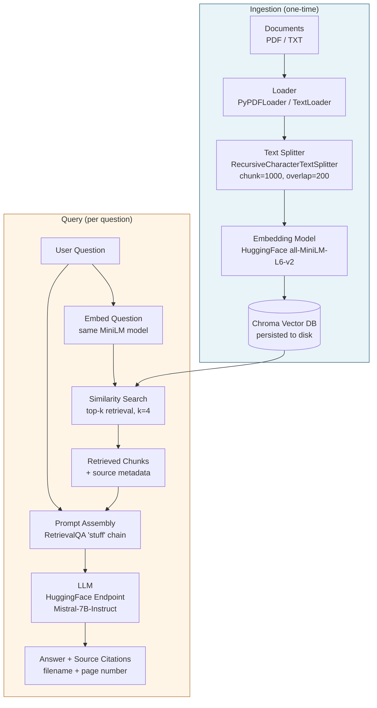

# RAG Project (Retrieval-Augmented Generation)

A Python-based Retrieval-Augmented Generation system using **LangChain**, **Chroma**, and **Hugging Face** models. Supports both plain-text and PDF document sources, with citations back to the originating page.

---

## Pipeline Overview

The diagram below shows what happens at **ingestion time** (one-time indexing) and at **query time** (every user question).



**In words:**

1. **Load** documents from disk (`PyPDFLoader` for PDFs, `TextLoader` for `.txt`).
2. **Split** them into ~1000-character chunks with 200-character overlap so context isn't lost at chunk boundaries.
3. **Embed** each chunk into a vector with `all-MiniLM-L6-v2` (384-dim) and persist in a local **Chroma** DB.
4. At query time, embed the user's question with the same model, run a top-k similarity search, and pass the retrieved chunks + question to a Hugging Face-hosted **Mistral-7B-Instruct** LLM via `RetrievalQA`.
5. Return the answer along with **source citations** (filename + page).

---

## Project Structure

```
RAG-Project/
├── src/
│   ├── rag.py              # Text RAG (single-file TextLoader)
│   └── rag_pdf.py          # PDF RAG (PyPDFLoader / PyPDFDirectoryLoader)
├── config/
│   └── settings.py         # Env-driven model + DB path config
├── data/
│   ├── pdf/                # Drop PDFs here for the PDF pipeline
│   ├── chroma_db/          # Persisted vectors (text pipeline)
│   └── chroma_db_pdf/      # Persisted vectors (PDF pipeline)
├── notebooks/
│   └── pdf_rag_walkthrough.ipynb   # Step-by-step PDF RAG walkthrough
├── tests/
├── main_text.py            # Entry point: text-file RAG
├── main_pdf.py             # Entry point: PDF-directory RAG
├── requirements.txt
├── .env.example
└── README.md
```

---

## Setup

### 1. Create + activate a virtual environment

**Windows (PowerShell):**
```powershell
python -m venv venv
.\venv\Scripts\Activate.ps1
```
If activation is blocked: `Set-ExecutionPolicy -ExecutionPolicy RemoteSigned -Scope CurrentUser`

**Linux / Mac:**
```bash
python -m venv venv
source venv/bin/activate
```

### 2. Install dependencies
```bash
pip install -r requirements.txt
```

> **Note:** the PDF pipeline also needs `pypdf` and `langchain-chroma`. If they're not pulled in transitively, install them explicitly:
> ```bash
> pip install pypdf langchain-chroma langchain-classic
> ```

### 3. Configure environment variables
```bash
copy .env.example .env       # Windows
# cp .env.example .env       # Linux/Mac
```
Edit `.env`:
```
HUGGINGFACEHUB_API_TOKEN=hf_your_token_here
HF_MODEL_NAME=mistralai/Mistral-7B-Instruct-v0.1
EMBEDDING_MODEL=all-MiniLM-L6-v2
VECTOR_DB_PATH=./data/chroma_db
PDF_VECTOR_DB_PATH=./data/chroma_db_pdf
```

Get a token from https://huggingface.co/settings/tokens (read access is sufficient).

---

## Running

### Text RAG
Drop a `.txt` file at `./data/sample.txt`, then:
```bash
python main_text.py
```

### PDF RAG
Drop PDFs into `./data/pdf/`, then:
```bash
python main_pdf.py
```
You'll get an interactive prompt:
```
Ask a question: What does paper_2 say about retrieval?

Answer: ...
Sources:
  - paper_2.pdf (page 4)
  - paper_2.pdf (page 7)
```

### Interactive walkthrough
For a step-by-step view of the PDF pipeline, open:
```
notebooks/pdf_rag_walkthrough.ipynb
```

---

## Configuration

`config/settings.py` reads from `.env`. Knobs you'll likely want to tune:

| Setting | Default | What it controls |
|---|---|---|
| `HF_MODEL_NAME` | `mistralai/Mistral-7B-Instruct-v0.1` | The LLM used for answer generation |
| `EMBEDDING_MODEL` | `all-MiniLM-L6-v2` | Sentence-transformer used for vectorization |
| `VECTOR_DB_PATH` | `./data/chroma_db` | Where text-RAG Chroma persists |
| `PDF_VECTOR_DB_PATH` | `./data/chroma_db_pdf` | Where PDF-RAG Chroma persists |

Chunking is set in code (`rag.py` / `rag_pdf.py`): `chunk_size=1000`, `chunk_overlap=200`, `k=3` (text) / `k=4` (PDF).

---

## Troubleshooting

**`401 Unauthorized` from Hugging Face**
Your `HUGGINGFACEHUB_API_TOKEN` is missing or invalid. Re-check `.env`.

**Stale results after replacing documents**
Chroma persists vectors across runs. Delete the relevant DB directory and re-ingest:
```powershell
Remove-Item -Recurse -Force .\data\chroma_db_pdf
```

**`No PDFs found in ./data/pdf`**
Make sure files are actually `.pdf` (not `.PDF` on case-sensitive systems — though Windows is fine) and live directly in `data/pdf/` or a subdirectory (the loader recurses).

---

## Next Steps

- Swap the LLM by changing `HF_MODEL_NAME` (e.g., `meta-llama/Llama-3-8b-instruct`).
- Add a reranker between retrieval and the LLM for higher answer quality.
- Wrap `main_pdf.py` in a FastAPI route for a web/UI-callable endpoint.
- Add evaluation in `tests/` (e.g., RAGAS or a small golden-answer set).
